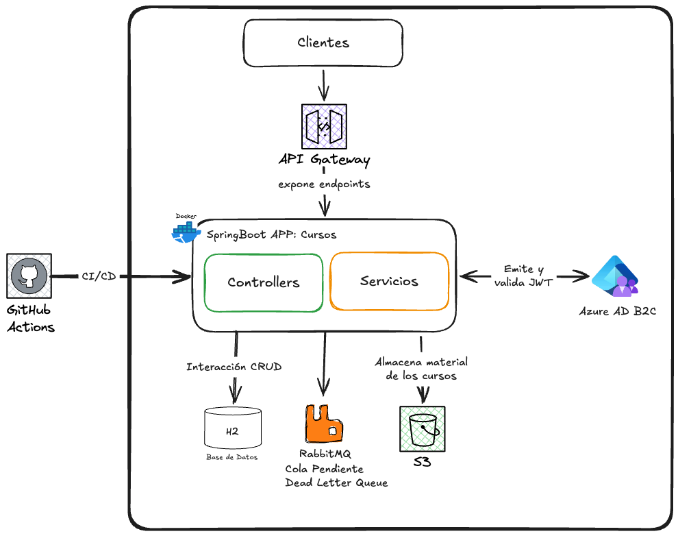
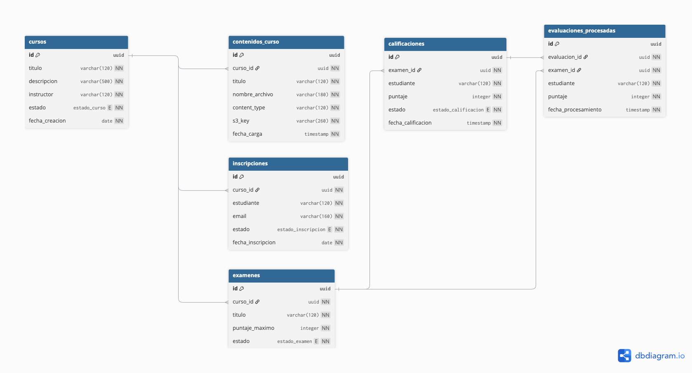

# Gestion de Cursos Online - Semana 9

Microservicio Spring Boot para la Evaluacion Final Transversal de Desarrollo Cloud Native. La aplicacion implementa una plataforma de cursos en linea donde estudiantes pueden inscribirse, acceder a material almacenado en la nube y rendir examenes; los instructores pueden administrar cursos, examenes y calificaciones.

La solucion usa un BFF para orquestar operaciones de la API, RabbitMQ para procesar evaluaciones de forma asincrona, Amazon S3 para almacenar contenido de cursos, JWT emitidos por Azure AD B2C como Identity as a Service, y esta preparada para exponerse mediante AWS API Gateway.

## Arquitectura de la solución

El diagrama de la solución es



## Base de Datos

La estructura se crea desde `src/main/resources/schema.sql`.



## Caracteristicas

- API REST para gestion de cursos, inscripciones, examenes y calificaciones.
- Microservicio BFF con endpoints para producir y consumir mensajes desde RabbitMQ.
- Seguridad stateless con Spring Security OAuth2 Resource Server.
- Autorizacion RBAC por roles `ADMIN`, `INSTRUCTOR` y `ESTUDIANTE` desde claims de Azure AD B2C.
- Cola principal `cola.evaluaciones.pendientes` para evaluaciones rendidas.
- Cola de errores `cola.evaluaciones.errores` mediante dead-letter exchange.
- Persistencia local con H2 en modo archivo.
- Tabla `evaluaciones_procesadas` para registrar mensajes consumidos.
- Carga y descarga de material de curso desde Amazon S3.
- Actuator para health checks.
- Dockerfile multi-stage con Java 21.
- Docker Compose para aplicacion y RabbitMQ Management.
- Workflow de GitHub Actions para test, build, push a DockerHub y despliegue en EC2.

## Stack tecnico

- Java 21
- Spring Boot 3.5.14
- Spring Web
- Spring Data JPA
- Spring Security
- OAuth2 Resource Server / JWT
- H2 Database
- RabbitMQ
- Spring AMQP
- AWS SDK for Java v2, modulo S3
- Maven
- Docker

## Estructura principal

```text
CloudNativeS9/
|-- Dockerfile
|-- docker-compose.yml
|-- pom.xml
|-- README.md
|-- .env.example
|-- .github/workflows/main.yml
`-- src/
    |-- main/
    |   |-- java/cl/duoc/cloudnative/cursos/
    |   |   |-- config/
    |   |   |-- controller/
    |   |   |-- dto/
    |   |   |-- model/
    |   |   |-- repository/
    |   |   |-- security/
    |   |   `-- service/
    |   `-- resources/
    |       |-- application.properties
    |       `-- schema.sql
    `-- test/
```

## Requisitos

- JDK 21.
- Maven 3.9 o superior.
- Docker, si se ejecuta como contenedor.
- RabbitMQ local mediante Docker Compose.
- Bucket S3 disponible.
- Credenciales AWS con permisos para operar sobre el bucket.
- Tenant, aplicacion y user flow de Azure AD B2C configurados para emitir JWT.
- API Gateway o API Manager para publicar los endpoints en nube.

## Configuracion

Copia el archivo de ejemplo y completa los valores reales:

```bash
cp .env.example .env
```

Variables principales:

| Variable | Descripcion |
| --- | --- |
| `AZURE_AD_B2C_ISSUER_URI` | Issuer del user flow de Azure AD B2C. |
| `AZURE_AD_B2C_JWK_SET_URI` | URL del set de llaves publicas para validar JWT. |
| `AWS_REGION` | Region AWS donde esta el bucket S3. |
| `AWS_ACCESS_KEY_ID` | Access key para AWS. |
| `AWS_SECRET_ACCESS_KEY` | Secret key para AWS. |
| `AWS_SESSION_TOKEN` | Token temporal, requerido en AWS Academy o credenciales temporales. |
| `S3_BUCKET` | Bucket donde se almacenan materiales de cursos. |
| `SPRING_DATASOURCE_URL` | URL JDBC de H2. |
| `SPRING_RABBITMQ_HOST` | Host RabbitMQ. En Docker debe ser `rabbitmq`. |
| `RABBITMQ_QUEUE_EVALUACIONES` | Cola principal de evaluaciones rendidas. |
| `RABBITMQ_QUEUE_EVALUACIONES_ERRORES` | Cola de errores de evaluaciones. |

> No subas `.env` ni credenciales reales al repositorio.

## Seguridad y RBAC

La API valida JWT emitidos por Azure AD B2C y lee los permisos desde el claim personalizado `extension_Role`. Spring agrega automaticamente el prefijo `ROLE_`, por lo que un token como este:

```json
{
  "extension_Role": "INSTRUCTOR"
}
```

se interpreta internamente como `ROLE_INSTRUCTOR`.

Tambien se acepta el claim como lista:

```json
{
  "extension_Role": ["INSTRUCTOR"]
}
```

Roles usados por la aplicacion:

| Rol | Responsabilidad |
| --- | --- |
| `ADMIN` | Acceso completo a operaciones administrativas, cursos, examenes y colas. |
| `INSTRUCTOR` | Gestiona cursos, materiales, examenes, calificaciones y procesamiento de colas. |
| `ESTUDIANTE` | Consulta cursos, descarga contenidos, se inscribe y rinde examenes. |

Matriz principal de permisos:

| Metodo | Endpoint | Roles |
| --- | --- | --- |
| `GET` | `/api/cursos/**` | `ADMIN`, `INSTRUCTOR`, `ESTUDIANTE` |
| `POST` | `/api/cursos` | `ADMIN`, `INSTRUCTOR` |
| `PUT` | `/api/cursos/**` | `ADMIN`, `INSTRUCTOR` |
| `POST` | `/api/cursos/*/contenidos` | `ADMIN`, `INSTRUCTOR` |
| `POST` | `/api/inscripciones` | `ADMIN`, `ESTUDIANTE` |
| `GET` | `/api/inscripciones/**` | `ADMIN`, `INSTRUCTOR` |
| `POST` | `/api/examenes` | `ADMIN`, `INSTRUCTOR` |
| `GET` | `/api/examenes/**` | `ADMIN`, `INSTRUCTOR`, `ESTUDIANTE` |
| `POST` | `/api/bff/examenes/*/rendir` | `ADMIN`, `ESTUDIANTE` |
| `POST` | `/api/bff/colas/**` | `ADMIN`, `INSTRUCTOR` |

## Ejecutar con Docker Compose

```bash
docker compose up --build
```

Servicios:

| Servicio | Puerto | Descripcion |
| --- | --- | --- |
| `app` | `8080` | API Spring Boot de cursos online. |
| `rabbitmq` | `5672` | Puerto AMQP usado por la aplicacion. |
| `rabbitmq` | `15672` | Consola RabbitMQ Management. |

URLs locales:

```text
API: http://localhost:8080
Health: http://localhost:8080/actuator/health
RabbitMQ Management: http://localhost:15672
```

Credenciales por defecto de RabbitMQ:

```text
User: guest
Password: guest
```

Para detener:

```bash
docker compose down
```

## Ejecutar local con Maven

Levanta RabbitMQ:

```bash
docker compose up -d rabbitmq
```

Luego ejecuta la aplicacion:

```bash
set -a
source .env
set +a
mvn spring-boot:run
```

Health check:

```bash
curl http://localhost:8080/actuator/health
```

## Flujo asincrono con RabbitMQ

```text
POST /api/bff/examenes/{id}/rendir
  -> registra calificacion en estado PENDIENTE
  -> publica EvaluacionMessage en cola.evaluaciones.pendientes

POST /api/bff/colas/evaluaciones/procesar
  -> consume mensajes pendientes desde cola.evaluaciones.pendientes
  -> guarda cada mensaje en evaluaciones_procesadas
  -> marca la calificacion como PROCESADA
```

Componentes principales:

| Clase | Responsabilidad |
| --- | --- |
| `RabbitMQConfig` | Declara exchanges, colas, bindings, `RabbitTemplate` y conversor JSON. |
| `EvaluacionProducer` | Publica evaluaciones rendidas y errores. |
| `EvaluacionQueueService` | Consume mensajes pendientes y registra evaluaciones procesadas. |
| `BffController` | Orquesta endpoints de la API para producir y consumir mensajes. |
| `CursoService` | Gestiona cursos y material almacenado en S3. |
| `S3StorageService` | Sube, descarga y elimina archivos en Amazon S3. |

## Endpoints principales

| Metodo | Endpoint | Uso |
| --- | --- | --- |
| `POST` | `/api/cursos` | Crear curso. |
| `GET` | `/api/cursos` | Listar cursos. |
| `PUT` | `/api/cursos/{id}` | Actualizar curso. |
| `POST` | `/api/cursos/{id}/contenidos` | Generar material de curso y subirlo a S3. |
| `GET` | `/api/cursos/{id}/contenidos` | Listar contenidos de un curso. |
| `GET` | `/api/cursos/contenidos/{contenidoId}/descargar` | Descargar material desde S3. |
| `POST` | `/api/inscripciones` | Inscribir estudiante. |
| `GET` | `/api/inscripciones/curso/{cursoId}` | Listar inscripciones por curso. |
| `POST` | `/api/examenes` | Crear examen. |
| `GET` | `/api/examenes/curso/{cursoId}` | Listar examenes por curso. |
| `POST` | `/api/bff/examenes/{id}/rendir` | Producir mensaje de evaluacion en RabbitMQ. |
| `POST` | `/api/bff/colas/evaluaciones/procesar` | Consumir mensajes desde RabbitMQ. |
| `GET` | `/api/examenes/{id}/calificaciones` | Listar calificaciones. |

## Ejemplos rapidos

Crear curso:

```bash
curl -X POST http://localhost:8080/api/cursos \
  -H "Authorization: Bearer <TOKEN>" \
  -H "Content-Type: application/json" \
  -d '{"titulo":"Arquitectura Cloud","descripcion":"Curso de microservicios y nube","instructor":"Arekkusu"}'
```

Rendir examen y publicar mensaje:

```bash
curl -X POST http://localhost:8080/api/bff/examenes/22222222-2222-2222-2222-222222222222/rendir \
  -H "Authorization: Bearer <TOKEN>" \
  -H "Content-Type: application/json" \
  -d '{"estudiante":"Alexis","puntaje":88}'
```

Consumir cola:

```bash
curl -X POST "http://localhost:8080/api/bff/colas/evaluaciones/procesar?limite=10" \
  -H "Authorization: Bearer <TOKEN>"
```

## API Manager

Los endpoints se pueden registrar en AWS API Gateway o Azure API Management. Para la entrega, se recomienda publicar como minimo:

- `/api/cursos/**`
- `/api/inscripciones/**`
- `/api/examenes/**`
- `/api/bff/**`
- `/actuator/health`

Cada ruta protegida debe exigir JWT emitido por Azure AD B2C. El health check puede quedar publico para monitoreo del despliegue.
